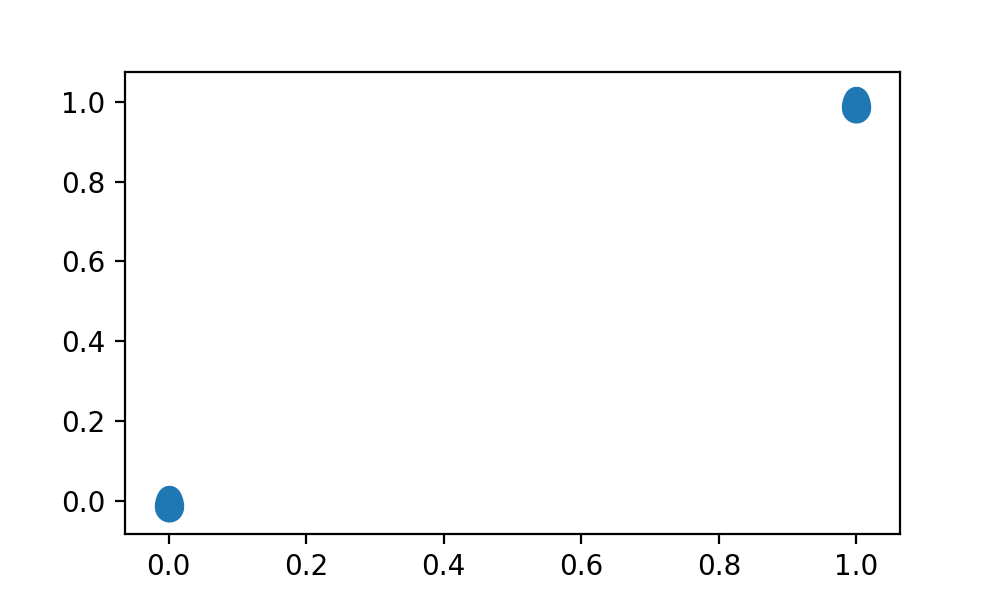

# eggcellent

Make excellent egg shapes.

# Install

It can be installed from command - line using
[pip](https://pypi.org/project/pip/):

```bash
pip install eggcellent
```

# Usage

## Use a default egg:

```python
from eggcellent import egg
import matplotlib.pyplot as plt
plt.scatter([0, 1], [0, 1], marker=None, verts=egg, s=200)
```



## Make your own egg

```python
from eggcellent import make_egg
egg = make_egg(a=2, b=3)
```

The egg equation is:

r = cos(2θ) + a \* cos(θ) + b
